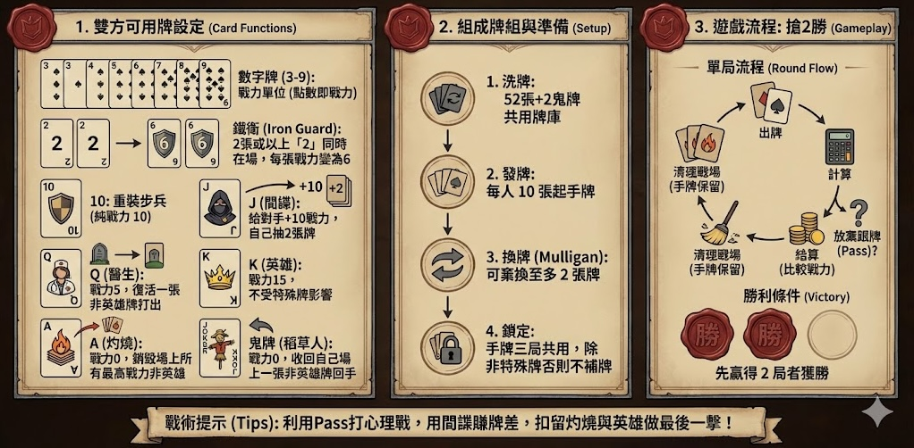

# Poker Tactics - 撲克戰略

**Poker Tactics** 是一個基於網頁的卡牌戰略遊戲，改編自《巫師 3》中的昆特牌（Gwent），但使用標準撲克牌進行遊玩。遊戲核心在於**資源管理**與**心理博弈**。

## 📖 遊戲規則簡介



本遊戲採用三戰兩勝制（Best of 3），玩家需要在有限的手牌資源中，策略性地贏得兩局勝利。

### 卡牌功能
| 牌面 | 角色 | 戰力 | 特殊能力 |
| :--- | :--- | :--- | :--- |
| **2** | 同袍兄弟 | 2 | 若場上有 2 張 **2**，戰力皆變為 6 (共 12 點)。 |
| **3-9** | 士兵 | 3-9 | 無特殊能力，點數即戰力。 |
| **10** | 重步兵 | 10 | 高戰力單位，無特殊能力。 |
| **J** | 間諜 (Spy) | 0 | 放置於對手場上（對手+10分），自己**抽 2 張牌**。 |
| **Q** | 醫生 (Medic) | 5 | 從棄牌堆**復活**一張非英雄牌並打出。 |
| **K** | 英雄 (Hero) | 15 | **金身**。不受灼燒(A)、稻草人(鬼牌)影響。 |
| **A** | 灼燒 (Scorch)| 0 | **銷毀**全場當前戰力最高的非英雄單位（雙方都算）。 |
| **鬼牌**| 稻草人 (Decoy)| 0 | 將場上一張非英雄牌**收回手牌**，鬼牌留場代替。 |

### 遊戲流程
1. **起手**：每人發 10 張牌，可調度（Mulligan）至多 2 張。
2. **出牌**：雙方輪流出一張牌。
3. **Pass**：若不想再出牌，可選擇 Pass。Pass 後該局無法再行動。
4. **結算**：雙方都 Pass 後比較總點數，高者得 1 勝。
5. **下一局**：場上所有牌移入棄牌堆。**注意：手牌不會補滿**（除非用間諜補牌），需用剩餘手牌進行下一局。

## 🛠️ 技術棧 (Tech Stack)

此專案為 Monorepo 架構：

### Client (Frontend)
*   **Framework**: Vue 3
*   **Build Tool**: Vite
*   **Language**: TypeScript
*   **State Management**: Pinia
*   **Styling**: Tailwind CSS
*   **i18n**: vue-i18n (支援 繁體中文 / 简体中文 / English)

### Server (Backend)
*   **Language**: Rust
*   **Web Framework**: Axum
*   **Real-time**: Socketioxide (Socket.IO)

## 🚀 快速開始 (Getting Started)

### 前置需求
*   Node.js (v20+)
*   Rust (最新穩定版)
*   Docker & Docker Compose

### 本地開發 (Local Development)

1.  **啟動後端伺服器 (Server)**
    ```bash
    cd server
    cargo run
    # Runs on http://0.0.0.0:3000
    ```

2.  **啟動前端應用 (Client)**
    ```bash
    cd client
    npm install
    npm run dev
    # Runs on http://localhost:5173
    ```

### Docker 部署 (Deployment)

使用 Docker Compose 一鍵啟動（包含 Cloudflare Tunnel 支援）：

```bash
docker-compose up -d --build
```

若需指定 Socket URL (例如部署到生產環境)：

```bash
docker compose build --build-arg VITE_APP_SOCKET_URL=https://your-domain.com
docker compose up -d
```

## 📂 專案結構

*   `client/`: 前端程式碼
*   `server/`: 後端 Rust 程式碼 (包含遊戲邏輯核心 `game_logic.rs`)
*   `game-rules.md`: 詳細遊戲規則說明文档
*   `GEMINI.md`: 專案上下文與開發筆記

## ⚖️ 法律免責聲明 (Legal Disclaimer)

### English
This project is a fan-made creation and is not affiliated with, endorsed, or approved by CD Projekt Red.
"Gwent" and "The Witcher" are registered trademarks of CD Projekt Red. All game mechanics heavily inspired by Gwent are implemented using standard playing cards to differentiate from the original IP.

This project is strictly non-commercial and intended for educational and entertainment purposes only.

### 繁體中文
本專案為粉絲自製作品，與 CD Projekt Red 無任何官方關聯，亦未經其認可或贊助。
「昆特牌 (Gwent)」與「巫師 (The Witcher)」為 CD Projekt Red 之註冊商標。本遊戲僅借鑒其遊玩機制，並使用標準撲克牌進行重新詮釋。

本專案僅供教育與娛樂目的，嚴禁任何形式之商業用途。

